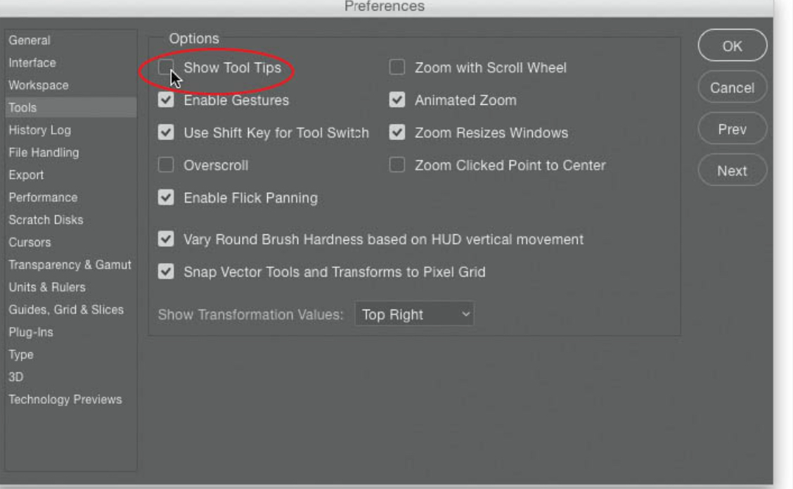

---
tags:
  - design
  - graphics
  - photoshop
date: 2025-02-16
updated: 2025-02-24
title: An Introduction to Photoshop
---
## A Very basic tutorial for a new user

> [!important] 
> New versions of Photoshop may not look the same as these screen images.
 
### Do this first

Turn off those annoying pop videos. 

### First set this up and add to the menu bar

- You can move the tools to where you like.

The toolbar looks like this as a default:

But you can add more tools to this bar

All windows and actions are under the Window menu, but you can make sure that frequently used panels are available through your custom set up.

On the top right you will see some provided workspaces:

> [!important] 
> But you can create your own 

Organise your spaces; here is an example:

You minimise the panels so you just see the icons and this gives you more space.

Then you can save your workspace to get it back later...

### The workshop / exercise

> [!tip] 
> This tutorial is designed to show how to use layers, subject selection, masking and adding text. 

We need these 2 files - get them from [here](https://notes.chrisjennings.net/media/photoshopfiles/einstein-on-the-beach.zip)

First we will start a new Photoshop file and create a new file. For use in Instagram we should use a square, but we can always crop this afterwards.

>Save this somewhere.

Now _Place_ (on the File menu use embedded) the beach scene image.

Resize to fit... and then click to confirm

Place Embedded  the einstein image and position at the bottom

#### Duplicate that layer and name it

Hide the original layer (click the eye icon) and create an adjustment layer below the new copy and choose solid color with any solid bright color.

### Getting rid of the background

There is more than one way to do this but here is my method:

With the top layer selected go to the Select menu item and choose _Select and Mask_

This panel may look different for you; please use these settings but do not press OK yet.

Find the **Select Subject** at the top and first choose the Detailed Results and then click Select Subject

Here is what we should see

You can now click the _Refine Hair_ button and this will make a difference to the detail around the hair.

Make sure that the Properties Panel shows _New Layer with Mask_ and then click OK

You might need to use the Eraser tool to remove any remains of the background.

Hide the Color Fill Layer and we have _Einstein on the Beach_. You can move him around as you like.

## Adding Text

First we create a text box with the text tool. (T in the tools) and then replace the Lorem iprum text with _Einstein on the Beach_

We can change the typeface though the Properties panel

### Maximum Flexibility

Now we are going to use this text separated out into 3 lines by copying and pasting 2 more copies. We can do this by dragging the layer onto the + sign

Now we need to change the type size and arrange the 3 lines

### Contrast is important for readability

So now we can use the Effects panel to add an outline (Outer Glow) where needed.

We see here that word goes over the head...

But we can reorder the layers and put the text under the head and even change the colour...

### There is a video available of this process hosted on my YouTube channel

<iframe style="width:100%;" width="720" height="405" src="https://www.youtube.com/embed/nAzyt8S6FQw?si=IUKQ4gizdCySkohE" title="YouTube video player" frameborder="0" allow="accelerometer; autoplay; clipboard-write; encrypted-media; gyroscope; picture-in-picture; web-share" referrerpolicy="strict-origin-when-cross-origin" allowfullscreen></iframe>

