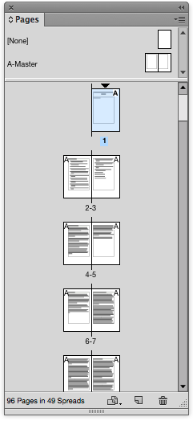
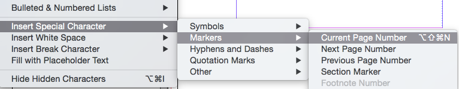
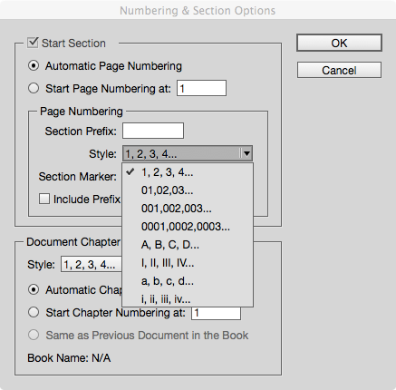
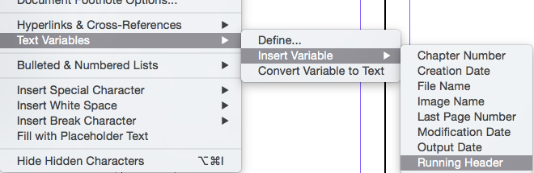

---
tags:
  - indesign
  - typography
date: 2025-02-16
updated: 2025-02-25
title: Master or Parent Pages in InDesign
---

**Or How to Repeat Content**

## The Pages Panel

The Pages panel will show you the pages in your document as thumbnails. You can configure the way this displays through the Panel Options from the context menu in the Pages panel.

> [!attention] 
> *Master* pages has been renamed *parent* pages in later versions of InDesign

In the image here, the pages panel shows the current pages in a scrolling pane, with the master pages on the top. In our document we only have the `A-Master` and this is applied to all pages in the file. We can add Master Pages and base one on another, so we effectively create a hierarchy of page attributes.

## Page Numbers

One common use for the Master Pages is to add a header and footer across a range of pages.

To add page numbers go to the master pages (in this case A-Master) and create a text box at the bottom left of the left hand page. With the text cursor in that box, go to the menu: `Type>Insert Special Character>Markers>Current Page Number`

You can add text before the letter A (this represents the page number itself), such as ‘Page:’ You should style this text block as you prefer.

Copy this and paste to the right hand page of ‘A-Master’. You will now see the page numbers displayed at the bottom of each of the pages in the document.

## Different Page Number Styles

In a printed book, you will often see different page numbers for the front matter. You may often see page numbers using small Roman Numerals. The text of the book proper may start after this ‘front-matter’. To achieve this we need to use the Numbering and section Options. We may need to start a new section at a particular page, and then use the alternative page numbering styles.

## Headers

It is traditional to add headers to the pages in a book. In the headers we can include the title of the book and possibly the section or chapter name.

Once again, in the master pages (A-Master) we can add text blocks to the top of the page. In the example here, I have also added a coloured bar; this will also repeat on all pages that use the ‘A-Master’.

## Running Headers

In order to achieve the display of the current chapter, we need to use ‘Text Variables’. We need to tell InDesign which style we are using for the chapter name, and then this text can be displayed in place of the variable that we select.

In the ‘A-Master’, we should first add a text box as before, but this time we need to insert the Text Variable>Running Header.

Now we need to define where this variable gets its value, by going to:

Type>Text Variables>Define. Select the Running Header and then in the dialogue box here, we need to select the paragraph style that the chapter heading is using.

As you can see there are other changes we can make to the text, if we need.

### Multiple Running Headers

The description above will cover a running header delivered from a paragraph style (typically a heading style) but there may be the need to take a variable from a character style.

In our Shakespeare play, we want the Act and Scene to be available in the header. The Act variable is straightforward, because this is a paragraph style and we can use the instructions above. The running header for the Scene can also use a paragraph style, however in our work we use 2 different paragraph styles for this; `scene` is the general style but `firstscene` is used for Scene heading after the Act heading (because we don't want this to start on a new page). In this scenario we need to add a _character style_ to those elements. This character style is merely a named style, it does not need to be used to present a different appearance.

Once the character style has been created it is very easy to use the `search/replace`method to look for the paragraph styles (scene and firstscene) and then replace the found content with the new character style. This character style can then be used as a new variable alongside our variable for the Act. The headings `scene` and `firstcene` will then have both a paragraph and a character style applied.

## Overriding Master Page Items

There are some situations where you want to remove the master page items on a particular page. One example might be where a page has a fully bled image and there is no space for the page numbers or headers; or maybe you just want a different style of page numbers for these types of pages.

There are 2 approaches to this problem. You could create a new master page—based on the ‘A-Master’ but with a different style for the headers and footers. This is the sensible choice where you know that this type of page is required more than once.

Alternatively, on one particular page, you can use the menu (from the pages panel context selector) ‘Override All Master Page Items’. This will bring all of the items on the master page on to the page where you can delete them. If you just want one item removed then hover over the item and use the keys: `shift-cmd` while you click the mouse. This will bring this one item onto the page, for you to delete or modify.

## Using the Book Panel

When combining chapters in a book we need to pay special attention to the way the master pages are synchronised across the different chapters.

You may want the master page items (such as book title in the header), to be the same across the whole book. However, if you are looking to use a different header in each chapter (maybe different colour banner), then do NOT synchronise the master pages.

These details are covered in another helper document - ‘Using the Book Panel in InDesign’.