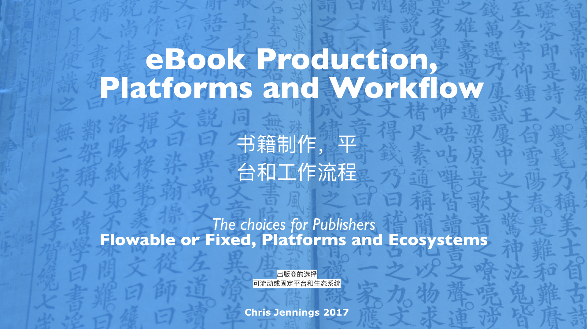

### The choices for Publishers - Flowable or Fixed, Platforms and Ecosystems

书籍制作，平台和工作流程

This is a presentation given to a group of Chinese Publishers.

Here are some references given in the talk:

[eBook Typography for Flowable eBooks](../eBooks/eBook%20Typography%20for%20Flowable%20eBooks.md) - an ebook authored by me

[From Print Book to eBook](../eBooks/From%20Print%20Book%20to%20eBook.md) - an eBook in iBooks Author from me
