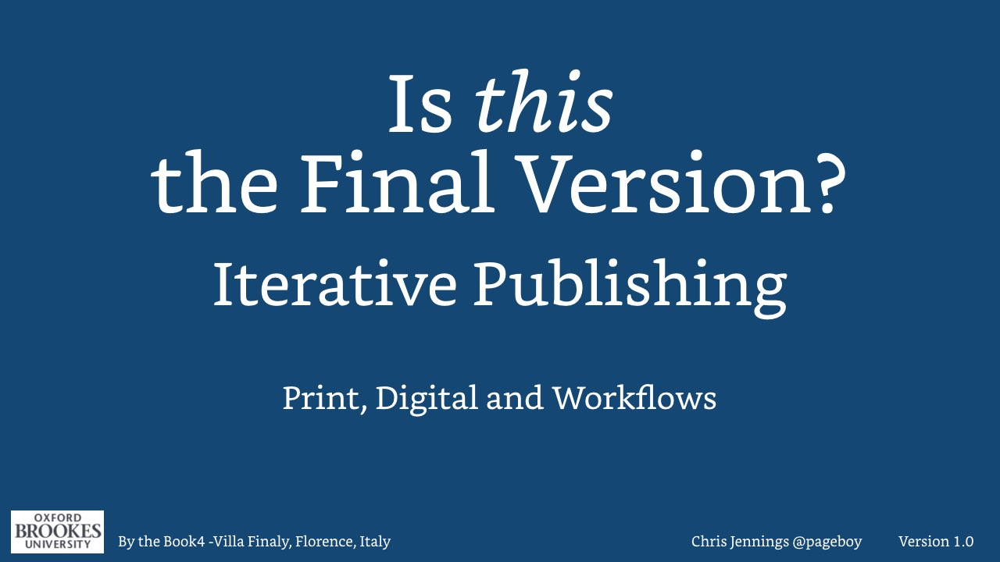

### Is this the Final Version?

In this presentation we look at the way that the reader of the book will know what version they are reading and the author / editor will know what version they are editing. We look at this in relation to print, digital and author or editor workflows.

This presentation was given at the _By the Book - 4_ conference in Florence, June 2017.
