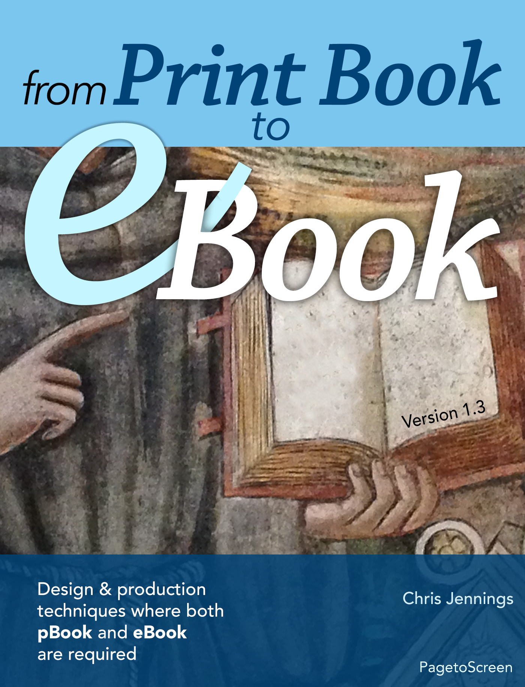

## Chris Jennings

**Design and Production Techniques Where Both Print Book and eBook Are Required**

The eBook uses the example of a Shakespeare Play with introductory text and images as well as some sample multimedia. The sample eBook is **built 3 ways**; as a Reflowable ePUB, a Fixed-Layout ePUB and a multi-touch eBook using iBooks Author.

	Built with iBooks Author

> [!note] 
>  I recently had to change the title and subtitle to conform to title case rules with Apple. Title case rules should conform to those recommended in '[The Chicago Manual of Style](http://www.pagetoscreen.net/ebooks/books/item/chicago_manual_of_style.html)'

[You can download the eBook from Apple here](https://books.apple.com/gb/book/from-print-book-to-ebook/id981068944)

or -

I have also made this freely available as a PDF

[Grab it here](https://notes.chrisjennings.net/eBookProduction/eBook_production1.30.pdf)

https://notes.chrisjennings.net/eBookProduction/eBook_production1.30.pdf

## Technical Stuff

#### Here is a chapter and section list:

- Introduction to eBook Design and Production
    - Why this Book
    - Decisions Decisions
    - eBook Formats
    - Platforms and Distribution
- Asset Management
    - Managing Your Assets
    - Text
    - Graphics
    - Multimedia
- Tools and Workflows
    - Indesign
    - Text Editors
    - XML Workflow
- Text to InDesign
    - Raw or Styled Text
    - Structure before Style
    - Text within InDesign
- Using the Book Panel in InDesign
    - Combining InDesign Files
    - Creating the Book
    - Pages and Spreads
- Building the Table of Contents
    - Automating the TOC
    - Cross Platform Table of Contents
- Attention to Detail
    - Typography
    - Poetry, Verse and Song
    - Grids
    - Threads and Columns
- Creating a Reflowable eBook from InDesign
    - Introduction
    - The Content
    - Back to Work
    - Colour
    - Paragraph and Character Styles
    - Placing Images
    - Book Front Matter
    - Getting Ready to Export
    - Export to ePUB(reflowable)
    - How does the ePUB Look?
- Editing the Inside of the ePUB
    - Unpacking
    - Repacking
    - How Can we Edit?
    - What Can we Edit?
    - Our First Correction
    - Test and View Our Changes
    - Roundtrip to InDesign
    - Other Changes to the CSS
    - Anything to Hide?
    - Footnote References
    - Typography and Fonts (Again)
    - The OPF Package Document
    - Landmarks
- Creating the Fixed Layout ePUB
    - InDesign Export to ePUB (fixed layout)
    - How does our Fixed Layout ePub look?
    - From reflowable to Fixed
    - Editing the ePUB package
    - Summary
- From InDesign to iBooks Author (edit: iBooks Author is no longer supported by Apple)
    - Templates
    - Layouts
    - From ePub to iBooks Author
    - From IDML to iBooks Author
    - The portrait View
    - Summary
- Extra Features and Enhancements
    - Adding Multimedia
    - Multimedia in the Fixed Layout ePUB
    - Ambient Sound
    - Multimedia in Apple's Multi-touch eBooks
    - Linked and Supplementary Information
    - Animation

Lots of screen images, samples and narrated video screencasts.