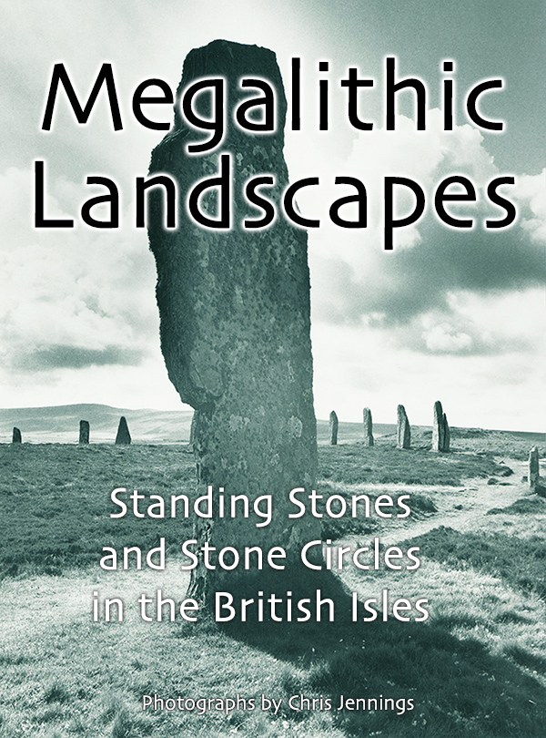

## Chris Jennings

At last, after 30 years, my book of photographs of Standing Stones and Stone Circles around the British Isles is now available as a fixed-format eBook and is on the Apple iBookstore.

Apple took several weeks to review the book, but I am pleased to say that it is currently on 50 stores worldwide!

## Technical Stuff

### The Content of the Book

The photographs in this book were taken by me (Chris Jennings) between 1975 and 1989. 

All of the photographs in this book were taken with ‘film’ cameras; colour with 35mm and monochrome with medium format or occasionally 35mm. Colour images were lab processed and then digitised by Kodak. Black and white photographs were processed and printed by the photographer and the prints were then scanned to 300dpi.

I travelled all over the British Isles (although not Ireland) - mostly camping in a converted Land Rover.

The black and white photographs exist as high quality bromide prints. These have been kept safe in light proof and dry conditions. These photographic prints have been scanned at high resolution. A minimum of editing has been done to the digital images (some duotone colouring and contrast enhancement).

The colour photographs come from 35mm slides (mostly Kodachrome). These were digitised a while back to Kodak's own proprietary digital format - PhotoCD. These have been converted and enhanced with PhotoShop.

### The technical Details of the eBook

The eBook was created mostly with Adobe Dreamweaver. Once the basic layout for each type of page (single photo, double photo, map, text etc) was created, then these were duplicated for each page. The format is ePUB3 with the fixed-format specification as advised by Apple.

#### Points to note

- Each image can be enlarged by pinching in
- the table of contents is available as a series of thumbnails or as a more traditional text based TOC
- At the rear of the book is an interactive alphabetical index of the sites. This list is scrollable.
- The British Isles map is interactive using HTML imagemaps
- Some photographs spread across 2 pages side-by-side

#### Versioning

Currently this is version 1.0 but the metadata is in place to release new versions. In the future I would like to add links to maps for each site.