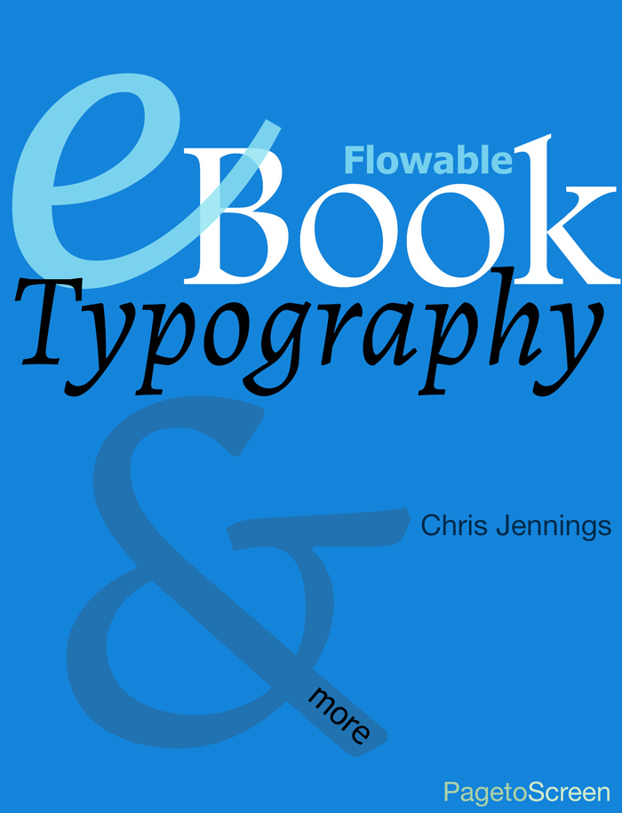

## Chris Jennings

Designers who work within publishing companies are often frustrated with the results when their beautifully crafted print books are converted to eBooks. Particularly if they are flowable eBooks, that can have their viewing modes and fonts changed by the user.

This eBook focuses on revealing some features that can be implemented in flowable eBooks, in order to improve the aesthetic qualities of the juxtaposition of text and image on the page.

[Download from Apple here](https://books.apple.com/gb/book/ebook-typography/id559791340)